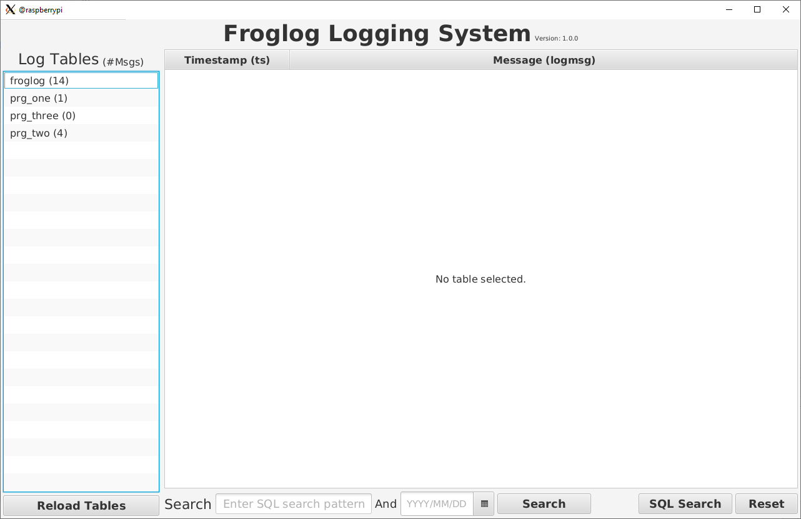
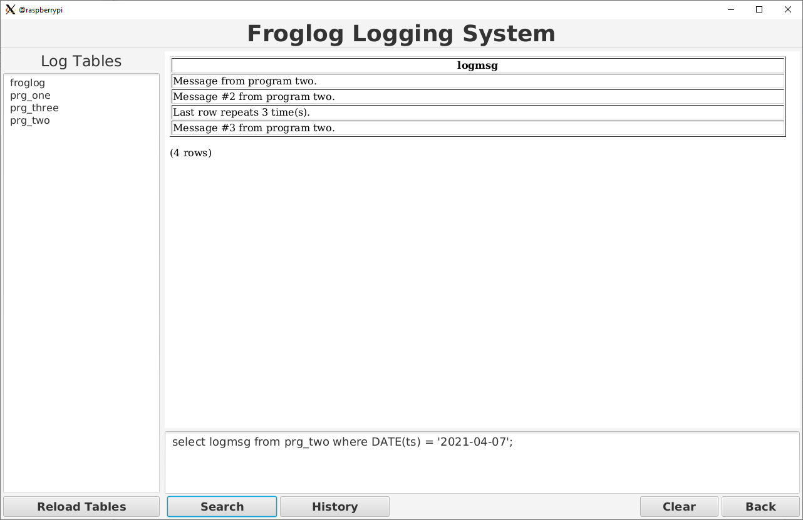

# froglog_gui
GUI for the Froglog program.

This program is written in JavaFX.

### (Why didn't I write it as a web application, so you could use a browser?)

I wrote the Froglog program to be accessed on local networks and not over the internet.  Some other reasons.

	Did not want a web server running on the system, this is an embedded like system.
	I like all the code to be in one localtion instead of split between the server and client.
	Did not want to deal with multiple lanaguages HTML, javscript, Node.js and others.
	I wanted to access the file system and postgreSQL which I believe is much easier in Java.
	IMO the state of web development is sad.  Do not get me started on all of the issues in web dev.

### Usage:

The main screen above will display all of the log tables currently in the database on the left hand side.  If you right click a table you get a popup menu to select Query, Purge, Create and Delete the table.  Also if you double click a table name will query the table.

In the popup menu the Purge, Create and Delete actions are password protected.  The default password is _LetFroglogin2_, this can be changed and probable should be changed for your environment.

The password is stored in a .ini file called froglog.ini in the working directory.  The password is stored as a sha256 sum of the password.  Use the script call froglogpwd or you can change it by hand by editing the froglog.ini file and replacing the adminPassword key/value pair with the output of the sha256sum program.

At the bottom of the screen are the following.

- Reload Tables - Reloads the log table and updates the message counts.
- Pattern - In this field enter SQL LIKE pattern to search the messages (logmsg) field in the table.
- Date - This date field is used to limit the query to the date given.
- Search - This button queries the table selected using the Pattern or and Date field.

- SQL Seach - This button takes you to a new screen so that you can enter more complex SQL queries.
- Reset - This button resets the Pattern and Date field to empty fields.

- NOTE: The Pattern and Date field will be used whether you use the **Search** button or double click a table name.

An example of an SQL search query.

The History screen allows you to select previous SQL statements entered.

## Install:

You could import the java/froglog_gui.zip file into an Eclipse IDE and recompile the code to create a jar file or use the already created jar file called lib/froglog.jar to run the Froglog GUI.

The other jar files in the lib directory are also needed to run the GUI.

You will need to install a Java 11 or better JVM.  On the Raspberry Pi, I used the [BellSoft](https://bell-sw.com/) release.  Download the JDK 11 for Linux ARM release for DEB and use the command below to install it on Raspberry Pi.

	sudo dpkg -i fileName.deb

I have included a Bash script to execute the java command line for the GUI called froglog.sh.  Place the froglog.sh in the same directory as the other jar files.  Nortmally I create a directory called Froglog in my home directory and copy all needed file their.
